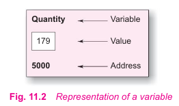

# Pointers

A pointer is a derived data type in C. It is built from one of the fundamental data types available in C. Pointers contain memory addresses as their values. Since these memory addresses are the locations in the computer memory where program instructions and data are stored, pointers can be used to access and manipulate data stored in the memory.

### Understanding pointers

The computer's memory is a sequential collection of *storage cells*. Each cell commonly known as a byte, has a number called *address* associated with it. Typically the address are numbered consecutively starting from zero. The last address depends on the memory on the memory size. A computer system having 64K memory will have its last address as 65,535.

Whenevee we declare a variable, the system allocates, somewhere in the memory, an appropriate location to hold the value of the variable. Since every byte has a unique address number, t his location will have its own address number.

Consider the following statement:

```c
int qunatity = 179;
```

This statement instructs the system to find a location for the integer variable **quantity** and puts the value 179 in that location. Let us assume that the system has chosen the address location 5000 for **quantity**.

