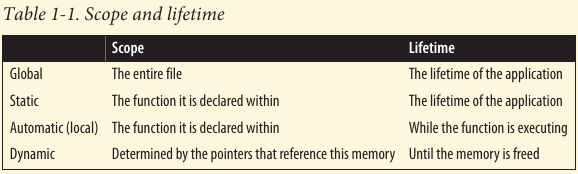

# Pointers

A solid understanding of pointers and the ability to effectively use them separates a novice C programmer from a more experienced one. Pointers pervade the language and provide much of its flexibility. They provide important support for dynamic memory
allocation, are closely tied to array notation, and, when used to point to functions, add another dimension to flow control in a program.

Pointers have long been stumbling block in learning C.

The key to comprehending pointers is understanding how memory is managed in a C program. After all pointers container addresses in memory.

## Pointers and Memory

When a C program is compiled, it works with three types of memory:

1. *Static/Global*

Statically declared variables are allocated to this type of memory. Global variables also use this region of memory. They are allocated when the program starts and remain in existence until the program terminates. When all functions have access to global variables, the scope of static variables is restricted to their defining function.

2. *Automatic*

These variables are declared within a function and are created when a function is called. Their scope is restricted to the function, and their lifetimes is limited to the time the function is executing.

3. *Dynamic*

Memory is allocated from the heap and can be released as necessary. A pointer reference the memory. It exists until it is released.



----------

Pointers have several uses, including:

- Creating fast and efficient code
- Providing a convenient means for addressing many types of programs
- Supporting dynamic memory allocation
- Making expressions compact and succinct
- Providing the ability to pass data structure by pointer without incurring a large overhead
- Protecting data passed as a parameter to a function.

----------

For example, in the following sequence, the third character of the names' second element is displayed with two different **printf** functions. While the two approaches are equivalent and will display the character n, the simpler approach is to use array notation.

```c
    char *names[] = {"Miller", "Jones", "Anderson"};
    printf("%c\n", *(*(names+1)+2));
    printf("%c\n", names[1][2]);
```

Pointers represent a powerful tool to create and enhance applications. On the downside, many problems can occur when using pointers, such as:

- Accessing arrays and other data structures beyond their bounds
- Referencing automatic variables after they have gone out of existence
- Referencing heap allocated memory after it has been released.
- Dereferencing a pointer before memory has been allocated to it.


## Declaring Pointers:

In the following example, an integer and a pointer to an integer are declared:

```c
// integer variable
int num;

// pointer variable
int *pi;
```

The following declaration is equivalent:

```c
int* pi;
int * pi;
int *pi;
int*pi;
```

The asterisk declares the variable as a pointer.