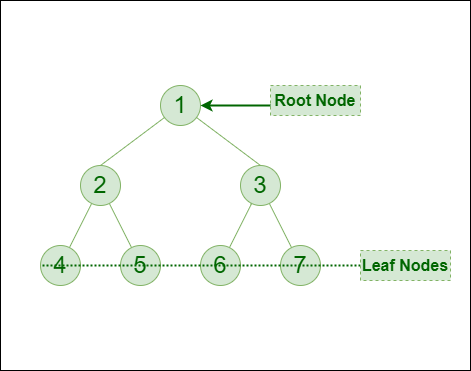

# Binary Tree Traversals:

Tree Traversal algorithms can be classified broadly into two categories:

- Depth-First Search (DFS) Algorithms
- Breadth-First Search (BFS) Algorithms

### Tree traversal algorithms can be classified broadly into two categories:

- **Preorder Traversal (current-left-right)**: Visit the current node before visiting any nodes inside the left or right subtrees. Here, the traversal is root – left child – right child. It means that the root node is traversed first then its left child and finally the right child.

- **Inorder Traversal (left-current-right)**: Visit the current node after visiting all nodes inside the left subtree but before visiting any node within the right subtree. Here, the traversal is left child – root – right child.  It means that the left child is traversed first then its root node and finally the right child.

- **Postorder Traversal (left-right-current)**: Visit the current node after visiting all the nodes of the left and right subtrees.  Here, the traversal is left child – right child – root.  It means that the left child has traversed first then the right child and finally its root node.

### Tree Traversal using Breadth-First Search (BFS) algorithm can be further classified into one category:

- **Level Order Traversal**:  Visit nodes level-by-level and left-to-right fashion at the same level. Here, the traversal is level-wise. It means that the most left child has traversed first and then the other children of the same level from left to right have traversed. 

Let us traverse the following tree with all four traversal methods:

**Pre-order Traversal of the above tree**: 1-2-4-5-3-6-7

**In-order Traversal of the above tree**: 4-2-5-1-6-3-7

**Post-order Traversal of the above tree**: 4-5-2-6-7-3-1

**Level-order Traversal of the above tree**: 1-2-3-4-5-6-7
