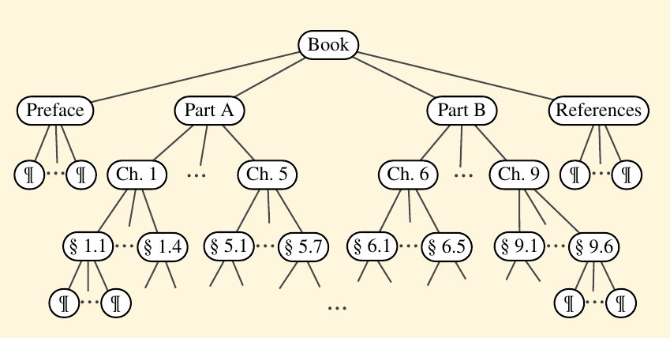

<h1>Ordered Trees</h1>

    A tree is <strong><em>ordered</em></strong> if there is a meaningfull linear order among the children of each node; that is, we purposefully identify the children of the a node as being the first, second, third, so on. Such an order is usually visualized by arranging siblings left to right, according to their order.

<h3>Examples</h3>

    The components of a structuerd document, such as a book, are heirarchy archiclly organized as a tree whose internal nodes are parts, chapters and sections and whose leaves are paragraphs, tables, figures, and so on.

    The root of the tree corresponds to the book itself. We could, in fact, consider expanding the tree further to show paragraphs consisting of sentences, sentences consisting of words, and words consisiting of characters. Such a tree is an example of an ordered treee, because there is a well-defined order among the children of each node.

An ordered tree associated with a book.

Let's look back at the other examples of trees. A family tree that describe generational relationship, is often modeled as an ordered tree, with siblings ordered according to their birth.