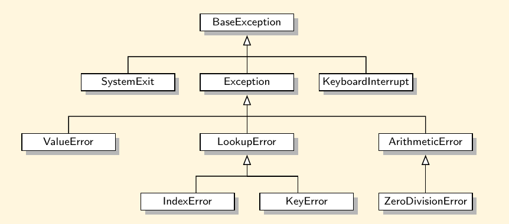

<h1>Binary Tree</h1>

    Tree structure are indeed a breakthrough in data organization for they allow us to implement a host of algorithms much faster than when using linear data structures, such as array-based lists or linked lists. Trees also provide a natural organization for data, and consequently have become ubiquitous structures in file systems, graphical user interfaces, databases, Web sites, and other computer systems.

    The main terminology for tree data structures comes from family trees, with the terms "parent", "child", "ancestor", and "descendant" being the most common words used to describe relationships.

<h2>
    Tree Definitions and Properties
</h2>

    A <strong><em>tree</em></strong> is an abstract data type that stores elements hierarchically. With the exception of the top element, each element in a tree has a <strong><em>parent</em></strong> element and zero or more <strong><em>children</em></strong> elements.

    A tree is usually visualized by placing elements inside ovals or rectangles, and by drawing the connections between parents and children with straight lines.

    The top element is called the <strong><em>root</em></strong> of the tree, but it is dawn as the highest element, with the other being connected below.

<h2>Formal Tree Definition</h2>

    We define a <strong><em>tree</em></strong> T as a set of <strong><em>nodes</em></strong> storing elements such that the nodes have a <strong><em>parent-child</em></strong> relationship that satisfies the following properties:

<ul>
    <li>
        If <em>T</em> is nonempty, it has a special node, called the <strong><em>root</em></strong> of <em>T</em>, that has no parent.
    </li>
    <li>
        Each node <em>v</em> of <em>T</em> different from the rooot has a unique <strong><em>parent</em></strong> node <em>w</em>; every node with parent <em>w</em> is a <strong><em>child</em></strong> of <em>w</em>.
    </li>
</ul>

<h2>Othe Node Relationships</h2>

    Two nodes that are children of the same parent are <strong><em>siblings</em></strong>. A node <em>v</em> is <strong><em>external</em></strong> if <em>v</em> has no children. A node <em>v</em> is <strong><em>internal</em></strong> if it has one or more children. External nodes are known as <strong><em>leaves</em></strong>.

<ul>
    <li>
        In the UNIX and Linux operating systems, the root of the tree is appropriately called the "root directory" and is represented by the symbol "/".
    </li>
    <li>
        A node <em>u</em> is an <strong><em>ancestor</em></strong> of a node <em>v</em> if <em>u</em> or <em>v</em> is an ancestor of the parent of <em>v</em>. We can say that <em>v</em> is a descendant of a node <em>u</em> it <em>u</em> is an ancestor of <em>v</em>
    </li>
    <li>
        For example, cs252/ is an ancestor of papers/, and pr3 is a descendant of cs016/.
    </li>
    <li>
        The <strong><em>subtree</em></strong> of <em>T</em> <strong><em>rooted</em></strong> at a node <em>v</em> is the tree consisting of all the descendants of <em>v</em> in <em>T</em> (including <em>v</em> itself). The subtree rooted at cs016/ consists of the nodes cs016/, grades, homeworks/, programs/, hw1, hw2, hw3, pr1, pr2, and pr3.
    </li>
</ul>   

<h2>Edges and Paths in Trees</h2>

    An <strong><em>edge</em></strong> of tree <em>T</em> is pair of nodes (<em>u</em>, <em>v</em>) such that <em>u</em> is the parent of <em>v</em>, or vice versa. A <strong><em>path</em></strong> of <em>T</em> is a sequence of nodes such that any two consecutive nodes in the sequence from an edge. 

    The inheritance relation between classes in a Python program forms a tree when single inheritance is used.

    The <em>BaseException</em> class is the root of that hierarchy, while all user-defined exception classes should conventionally be declared as descendants of the more specific <em>Exception</em> class.

