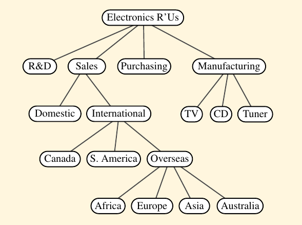
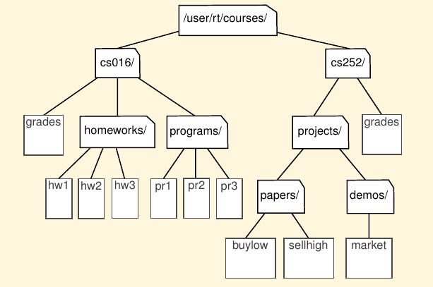

# Binary Tree

Tree structure are indeed a breakthrough in data organization for they allow us to implement a host of algorithms much faster than when using linear data structures, such as array-based lists or linked lists. Trees also provide a natural organization for data, and consequently have become ubiquitous structures in file systems, graphical user interfaces, databases, Web sites, and other computer systems.

The main terminology for tree data structures comes from family trees, with the terms "parent", "child", "ancestor", and "descendant" being the most common words used to describe relationships.

## Tree Definitions and Properties

A ***tree*** is an abstract data type that stores elements hierarchically. With the exception of the top element, each element in a tree has a ***parent*** element and zero or more ***children*** elements.

A tree is usually visualized by placing elements inside ovals or rectangles, and by drawing the connections between parents and children with straight lines.

The top element is called the ***root*** of the tree, but it is dawn as the highest element, with the other being connected below.

## Formal Tree Definition

We define a ***tree*** T as a set of ***nodes*** storing elements such that the nodes have a ***parent-child*** relationship that satisfies the following properties:

- If *T* is nonempty, it has a special node, called the ***root*** of *T*, that has no parent.
- Each node *v* of *T* different from the rooot has a unique ***parent*** node *w*; every node with parent *w* is a ***child*** of *w*.

## Othe Node Relationships

Two nodes that are children of the same parent are ***siblings***. A node *v* is ***external*** if *v* has no children. A node *v* is ***internal*** if it has one or more children. External nodes are known as ***leaves***.

<ul>
    <li>
        In the UNIX and Linux operating systems, the root of the tree is appropriately called the "root directory" and is represented by the symbol "/".
    </li>
</ul>