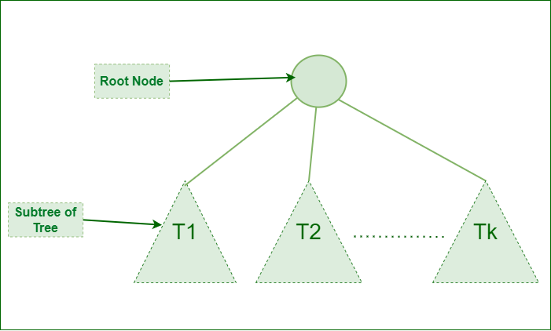

# Introduction to Tree - Data Structure and Algorithm Tutorials

A **tree data structure** is a hierarchical structure that is used to represent and organize data in a way that is easy to navigate and search. It is a collection of nodes that are connected by edges and has a hierarchical relationship between the nodes. 

The topmost node of the tree is called the root, and the nodes below it are called the child nodes. Each node can have multiple child nodes, and these child nodes can also have their own child nodes, forming a recursive structure.


This data structure is a specialized method to organize and store data in the computer to be used more effectively. It consists of a central node, structural nodes, and sub-nodes, which are connected via edges. We can also say that tree data structure has roots, branches, and leaves connected with one another.


## Basic Terminologies In Tree Data Structures

- **Parent Node**: This node which is a predecessor of a node is called the parent node of that node. **{B}** is the parent node of **{D, E}**.
- **Child Node**: The node which is the immediate successor of a node is called the child node of that node. Examples: **{D, E}** are the child nodes of **{B}**.
- **Root Node**: The topmost node of a tree or the node which does not have any parent node is called the root node. `{A}` is the root node of the tree. A non-empty tree must contain exactly one root node and exactly one path from the root to all other nodes of the tree.
- **Leaf Node or External Node**: The nodes which do not have any child nodes are called leaf nodes. **{K, L, M, N, O, P}** are the leaf nodes of the tree.
- **Ancestor of a Node**: Any predecessor nodes on the path of the root to that node are called Ancestors of that node. **{A,B} **are the ancestor nodes of the node **{E}**
- **Descendant**: Any successor node on the path from the leaf node to that node. **{E,I}** are the descendants of the node **{B}**.
- **Sibling**: Children of the same parent node are called siblings. **{D,E}** are called siblings.
- **Level of a node**: The count of edges on the path from the root node to that node. The root node has level **0**.
- **Internal node**: A node with at least one child is called Internal Node.
- **Neighbour of a Node**: Parent or child nodes of that node are called neighbors of that node.
- **Subtree**: Any node of the tree along with its descendant.

## Representation of Tree Data Structure

A tree consists of a root, and zero or  more subtrees T1, T2, T3 ..., Tk such that there is an edge from the root of the tree to the root of each subtree.




### Representation of a Node in Tree Data Structure:

```
struct Node
{
   int data;
   struct Node *first_child;
   struct Node *second_child;
   struct Node *third_child;
   .
   .
   .
   struct Node *nth_child;
};
```

### Example of Tree Data Structure


Here

- Node 1 is the root node
- 1 is the parent of 2 and 3
- 2 and 3 are the siblings
- 4, 5, 6, and 7 are the leaf nodes
- 1 and 2 are the ancestors of 5

[Type of Tree >>>](102-types-of-trees.md)