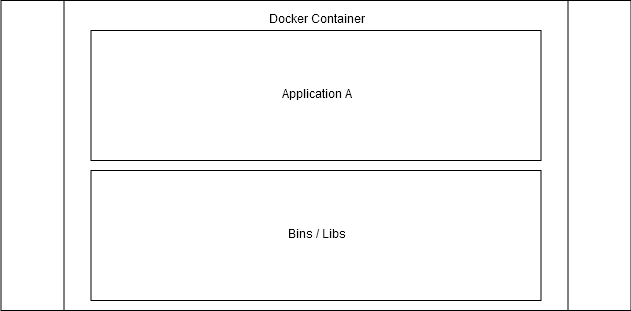
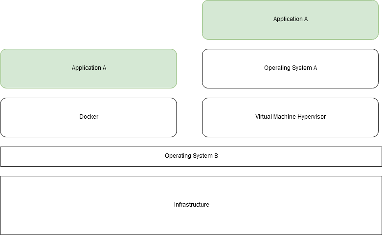

# Definitions and basic concepts

## What is DevOps?

Defining DevOps is not a trivial task but the term itself consists of two parts, *Dev* and *Ops*. Dev refers to the development of software and Ops to operations. Simple definition for DevOps would be that it means the release, configuring, and monitoring of software is in the hands of the very people who develop it.

A more formal definition is offered by Jabbari et al.: "DevOps is a development methodology aimed at bridging the gap between Development and Operations, emphasizing communication and collaboration, continuous integration, quality assurance and delivery with automated deployment utilizing a set of development practices".


## What is Docker?

"Docker is a set of platform as a service (PaaS) products that use OS-level virtualization to deliver software in packages called containers."

So stripping the jargon we get two definitions:

1. Docker is a set of tools to deliver software in containers.
2. Containers are packages of software.





The above image illustrates how containers include the application and its dependencies. These containers are isolated so that they don't interfere with each other or the software running outside of the containers. In case you need to interact with them or enable interactions between them, Docker offers tools to do so.

## Benefits from containers

Containers package applications. Sounds simple, right? To illustrate the potential benefits let's talk about different scenarios.

### Scenario 1: Works on my machine

Containers solve this problem by allowing the developer to personally run the application inside a container, which then includes all of the dependencies required for the app to work.

### Scenario 2: Isolated environments

Since containers package the software with all of its dependencies, you package the existing app and all 5 new ones with their respective Python versions and that's it.

### Scenario 3: Development

With one command you get an isolated application, like Postgres or Mongo, running in your machine.

### Scenario 4: Scaling

Starting and stopping a Docker container has little overhead. But when you run your own Netflix or Facebook, you want to meet the changing demand. With some advanced tooling that we will learn about in parts 2 and 3, we can spin up multiple containers instantly and load balance traffic between them.


## Virutal Machines

Isn't there already a solution for this? Virtual Machines are not the same as Containers - they solve different problems. We will not be looking into Virtual Machines in this course. However, here's a diagram to give you a rough idea of the difference.



The difference between a virtual machine and Docker solutions arises after moving Application A to an incompatible system "Operating System B". Running software on top of containers is almost as efficient as running it "natively" outside containers, at least when compared to virtual machines.

So containers have a direct access to your own Operating Systems kernel and resources. The resource usage overhead of using containers is minimized, as the applications behave as if there were no extra layers. As Docker is using Linux kernels, Mac and Windows can't run it without a few hoops and each have their own solutions on how to run Docker.

## Running containers

The hello-world is a simple application that outputs "Hello from Docker!" and some additional info.

Simply run `docker container run hello-world`, the output will be the following:

```bash
$ docker run hello-world
Unable to find image 'hello-world:latest' locally
latest: Pulling from library/hello-world
719385e32844: Pull complete 
Digest: sha256:4f53e2564790c8e7856ec08e384732aa38dc43c52f02952483e3f003afbf23db
Status: Downloaded newer image for hello-world:latest

Hello from Docker!
This message shows that your installation appears to be working correctly.

To generate this message, Docker took the following steps:
 1. The Docker client contacted the Docker daemon.
 2. The Docker daemon pulled the "hello-world" image from the Docker Hub.
    (amd64)
 3. The Docker daemon created a new container from that image which runs the
    executable that produces the output you are currently reading.
 4. The Docker daemon streamed that output to the Docker client, which sent it
    to your terminal.

To try something more ambitious, you can run an Ubuntu container with:
 $ docker run -it ubuntu bash

Share images, automate workflows, and more with a free Docker ID:
 https://hub.docker.com/

For more examples and ideas, visit:
 https://docs.docker.com/get-started/
```