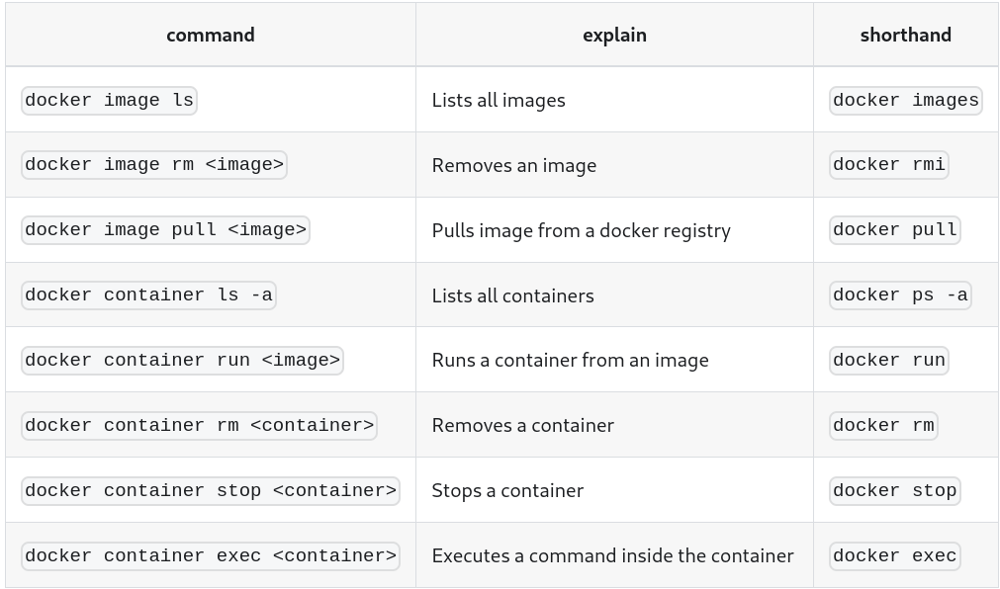

# Docker CLI basics

We are using the command line to interact with the "Docker Engine" that is made up of 3 parts: **CLI**, a **REST API** and **Docker daemon**. When you run a command, e.g. `docker container run`, behind the scenes the client sends a request through the REST API to the Docker daemon which takes care of images, containers and other resources.

