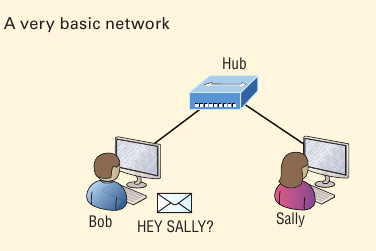
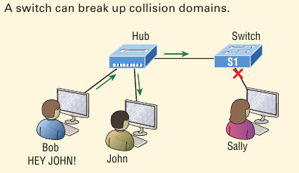
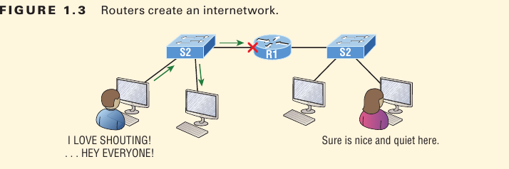
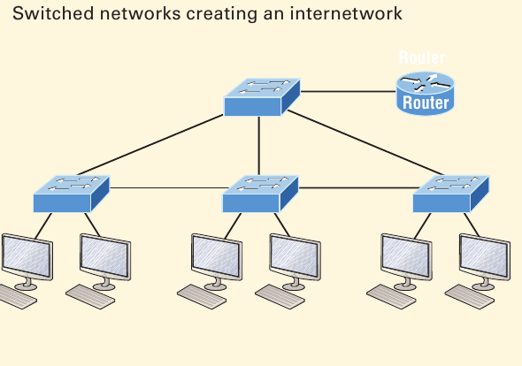
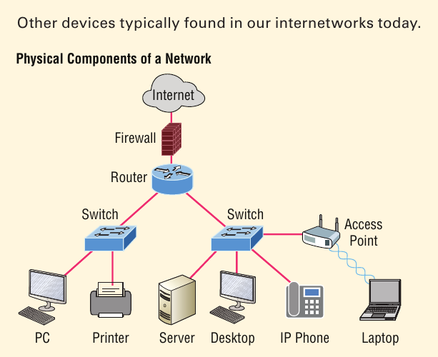

# Internetworking Baics

A basic *local area network (LAN)* that's connected using a *hub*, which is basically just an antiquated device that connects wires together. 

- Simple network like this would be coonsidred one **collision domain** on one **broadcast domain**.

- Let understant this figure with this scenario: Bob wants to snd Sally a file, and to complete that goal in this kind of network, he'll simply broadcast that he's looking for her, which is basically just shouting out over the network. 

- Think of it like this: Bob walks out of his house and yells down a street called Chaos Court in order to contact Sally. This might work if Bob and Sally were the only ones  living there, but not so much if it’s crammed with homes and all the others living there  are always hollering up and down the street to their neighbors just like Bob. Nope, Chaos Court would absolutely live up to its name, with all those residents going off whenever they felt like it—and believe it or not, our networks actually still work this way to a  degree! So, given a choice, would you stay in Chaos Court, or would you pull up stakes and move on over to a nice new modern community called Broadway Lanes, which offers plenty of ame nities and room for your home plus future additions all on nice, wide streets that can easily handle all present and future traffic? If you chose the latter, good choice... so did Sally, and she now lives a much quieter life, getting letters  (packets) from Bob instead of a headache!.

And this is no joke; most of us think of growth as good—and it can be—but as many of us experience daily when commuting to work, school, etc., it can also mean your LAN’s traffic congestion can reach critical mass and grind to a complete halt! 

The Solution to this problem begins with breaking up a massive network into a number of smaller ones--something called ***network segmentation***. This concept is like planning a new community or modernizing an existing one. In a networking neighborhoood environment, all of this is carried out using devices like *routers*, *switches*, and *bridges*.

----------

This figure shows a network that's been segmented with a switch, making each network segment that connects to the switch it's own separate *collision domain*.

- This is great, but this networkin is still one, single *broadcast domain*, meaning that we've really only decreased our screaming and yelling, not eliminated it.

- For example, if there’s some sort of vital announcement that everyone in our neighborhood needs to hear about, it will definitely still get loud! You can see that the hub used in Figure 1.2 just extended the one collision domain from the switch port. The result is that John received the data from Bob but, happily, Sally did not. This is good  because Bob intended to talk with John directly, and if he had needed to send a broadcast instead, everyone, including Sally, would have received it, possibly causing unnecessary  congestion.

Here's a list of some of things that commonly cause LAN traffic congestion:

- To many hosts in a collision or broadcast domain
- Broadcast storms
- Too much multicast traffic
- Low bandwidth
- Adding hubs for connectivity to the network
- A bunch of ARP broadcasts

----------

Hubs don’t segment a network; they just connect network segments. Basically, it’s an inexpensive way to connect a couple of PCs, and again, that’s great for home use and troubleshooting, but that’s about it!

Routers are used to connect  networks and route packets of data from one network to another. So never forget that by default, routers are basically employed to efficiently break up a *broadcast domain*—the set of all devices on a network segment, which are allowed to “hear” all broadcasts sent out on that specific segment.

- Each host is connectet to its own collision domain because of the switch, and the router has created two broadcast domains.

- So now our Sally is happily living in peace in a completely different neighborhood,
no longer subjected to Bob’s incessant shouting! If Bob wants to talk with Sally, he has to

Routers provide connections to *wide area network (WAN)* services as well via a serial interface for WAN connections—specifically, a *V.35 physical interface on a
Cisco router*.

#### why breaking up a broadcast domain is so important

When a host or server sends a network broadcast, every device on the network must read
and process that broadcast—unless you have a router. When the router’s interface receives
this broadcast, it can respond by basically saying, “Thanks, but no thanks,” and discard
the broadcast without forwarding it on to other networks. Even though routers are known
for breaking up broadcast domains by default, it’s important to remember that they break
up collision domains as well.

There are two advantagse to using routes in your networks:

- They don't forward broadcasts by default
- They can fitler the network based on layer 3 (Network layer) information such as an IP address.

Here are four ways a router functions in your network:

- Packet Switching
- Packet filtering
- Internetwork communication
- Path selection

----------

- Routers are like layer 3 swtiches.
- Routers (layer 3 switches) uses logical addressing and provide an important capacity called **packet switching**.
- Routers also provide **packet filtering** via access lists, and when routers connect two or more networks together and use logical addressing (IP or IPv6), you then have an *internetwork*.
- Finally routers use a routing table, which is essentially a map of the internetwork, to make best path selections for getting data tot its proper destination and properly forward packets to remote networks.

---------

The main purpose of these switches is to make a LAN work better—to optimize its performance—providing more bandwidth for the LAN’s users. Also, these switches don’t forward packets to other networks like routers do. Instead, they only “switch” frames from one port to another within the switched network.

By default switches breaks up collision domains.

*Collision domain* is an Ethernet term used to describe a network scenerio in which one device sends a packet out on a network segment and every other device on that same segment is forced to pay attention no matter what. This isn’t very efficient because if a different device tries to transmit at the same time, a collision will occur, requiring both devices to retransmit, one at a time—not good! This happens a lot in a hub environment, where each host segment connects to a hub that represents only one collision domain and a single broadcast domain. By contrast, each and every port on a switch represents its own collision domain, allowing network traffic to flow much more smoothly.

The term bridging was introduced before routers and switches were implemented, so it’s pretty common to hear people referring to switches as bridges. That's because bridges and switches basically do the same thing -- break up collision domains on a LAN. 

Switches do provide a bridging function, but they do that with greatly enhanced management ability and features.  Plus, most bridges had only 2 or 4 ports, which is severely limiting. Of course, it was possible to get your hands on a bridge with up to 16 ports, but that’s nothing compared to the hundreds of ports available on some switches!

#### Internetworking devices

- The router has the center stage position and connects each physical network together.

- The bridge breaks up collision domains but all the hosts connected to both hubs are still crammed into the same broadcaet domain. The bridge also created only three collision domains, one for each port, which means that each device connected to a hub is in the same collision domain as every other device connected to that same hub.

- The three interconnected hubs at the bottom of the figure also connect to the router. This setup creates one collision domain and one broadcast domain and makes that bridge network, with its two collision domains.

- the broadcase domains are definitely the easiest to spot because only routers break up broadcast domains by default, and since there are three interface connections, that gives you three broadcast domains.

- The all-hum network at the bottom is one collision domain; the bridge network on topi equals three collision domains. Add in the swtich newtork for five collision domains--one for each switch port--and you get a total of nine.

----------

The best network connected to the router is the LAN switched network, because each port on that switch breaks up collision domains. But all devices are still in the same broadcast domain. Because all devices must listen to all broadcasts transmitted, that’s why! And if your broadcast domains are too large, the users have less bandwidth and are required to process more broadcasts. Network response time eventually will slow to a level that could cause riots and strikes, so it’s important to keep your broadcast domains small in the vast majority of networks today.

Here I’ve placed the LAN switches at the center of this network world, with the router connecting the logical networks. If I went ahead and implemented this design, I’ll have created something called virtual LANs, or VLANs, which are used when you logically break up broadcast domains in a layer 2, switched network. It’s really important to understand that even in a switched network environment, you still need a router to provide communication between VLANs. Don’t forget that!

- each port on the swtich is a separate collision domain, and each VLAN would be separate broadcast domain. Counting 12 collision domain (connection between swtiches is considered a collision domain).
- the figure doesn't show any VLAN information we can assume the default of one broadcast domain is in place.

----------

- WLAN devices: These devices connect wireless devices such as computers, printers, and tablets to the network

- Access Points or APs: These devices allow woreless devices to connect to a wired network and extend a collision domain from a switch, and are typically in their own broadcast domain or what we'll refer to as a virtual LAN (VLAN).

- WLAN Controllers: These are the devices that network administrators or networks operations uses to manage access points in medium to large to extemely large quantities. The WLAN controller automatically handles the configuration of wireless access points and was typically used only in larger enterprise systems.

- Firewalls: These devices are network security systems that monitor and control the incoming and outgoing network traffic based on predetermined security rules, and it usually an Intrusion Protection System (IPS).