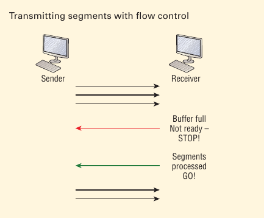

# Flow Control

Its job is to ensure data integrity at the Transport layer by allowing applications to request reliable data transport between systems. 

Flow control prevents a sending host on one side of the connection from overflowing the buffers in the receiving host. Reliable data transport employs a connection-oriented communications session between systems, and the protocols involed ensure that the following will be achieved:

- The segments delivered are acknowledged back to the send up their reception.
- Any segments not acknowledged are retransmitted.
- Segments are sequence back into their proper order upon arrival at their destination.
- A manageable data flow is maintained in order to avoid congestion, overloading, or worse, data loss.

Instead of dumping and losing data, the Transport layer can issue a  “not ready” indicator to the sender, or potential source of the flood.After the peer receiver processes the segments already in its memory  reservoir—its buffer—it sends out a “ready” transport indicator. When  the machine waiting to transmit the rest of its datagrams receives this“go” indicator, it resumes its transmission. 

