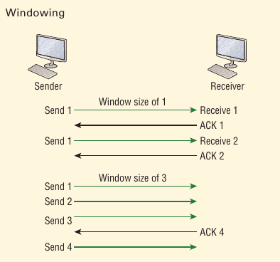

# Windowing

It would be painfull if the transmitting machine had to wait for acknowledgement after sending each and every segment. The quantity of data segments, measured in bytes, that the transmitting machine is allowed to send without receiving an acknowledgement is called *windowing*.

The size of the window controls how the much information is transffered from one end to the other before an acknowledge is required. While some protocols quantify information depending on the number of packets, TCP/IP measures it by counting the number of bytes.

If you’ve configured a window size of 1, the sending machine will wait  for an acknowledgment for each data segment it transmits before  transmitting another one but will allow three to be transmitted before  receiving an acknowledgement if the window size is set to 3.

----------

If a receiving host fails to receive all the bytes that it should acknowledge, the host cam improve that communicatoin session by decreasing the window size.