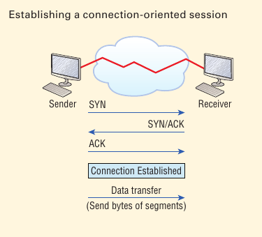

# The Transport Layer

The *Transport layer* segments and ressembles data into a single data stream. Services located at this layer take all the various data received from upper-layer applications, the combine it into the same, concise data stream. These protocols provide end-to-end data transport services and can establish a logical connection betweeen the sending host and destination host on an internetwork.

A pair of well-known protocols called TCP and UCP. TCP is known as a reliable service and UDP is not.

The Transport layer is responsible for providing mechanims for multiplexing upper layer applications, establishing sessions, and tearing down virtual circuits. It can also hide the detains of network-dependent information from the higher layers as well as provide transparent data transfer.

----------

The term reliable networking can be used at the Transport layer. Reliable networking requires that acknowledgements, sequencing, and flow control will all be used.

----------

## Connection-Oriented Communication

For reliable transport to occur, a device that wants to transmit must first establish a connection-oriented communication session with a remote device--its peer system--known as a *call setup* or a *three-way-handshake*. Once this process is complete, the data transfer occurs, and when it's finished, a call termination takes place to tear down the virtual circuit.

Now while the information is being transferred between hosts, the two machines periodically check in with each other, communicating through their protocol software to ensure that all is going well and that the data is being received properly.

#### Summarization:

- The "connection agreement" segment is a request for *synchronization* (SYN).
- The next segments acknowledgement (ACK) the request and establish connection parameters synchronized here as well so that a bidirectional connection can be formed.
- The final segment is also an acknowledgement, which notifies the destination host that the connection agreement has been accepted and that the actual connection has been established. Data transfer can now begin.

----------

Sounds pretty simple, but things don’t always flow so smoothly. Sometimes during a transfer, congestion can occur because a high-speed computer is generating data traffic a lot faster than the network itself can process it! And a whole bunch of computers simultaneously sending datagrams through a single gateway or destination can also jam things up pretty badly. In the latter case, a gateway or destination  can become congested even though no single source caused the problem. Either way, the problem is basically akin to a freeway bottleneck—too much traffic for too small a capacity. It’s not usually one car that’s the problem; it’s just that there are way too many cars on that freeway at once!

But what actually happens when a machine receives a flood of datagrams  too quickly for it to process? It stores them in a memory section  called a *buffer*. Sounds great; it’s just that this buffering action  can solve the problem only if the datagrams are part of a small burst. If the datagram deluge continues, eventually exhausting the device’s  memory, its flood capacity will be exceeded and it will dump any and  all additional datagrams it receives just like an inundated overflowing bucket!

----------

A service is considered connection-oriented if it has the following characteristics:

1. A virutal circuit, or "three-way handshake", is set up.
2. It uses sequencing
3. It uses acknowledgement
4. It uses flow control

