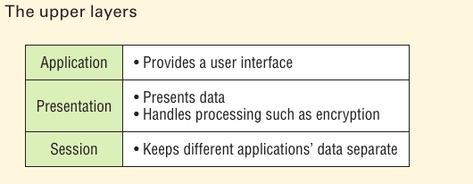

# The OSI Reference Model

- OSI model paves the way for the data transfer between disparate hosts running different operating systems, like Unix hosts, Windows machines, Macs, Smartphones, and so on.

- The OSI is a logical model, not a physical one. It's essentially a set of guidelines that developers can use to create and implement applications to run on a network. It also provides a framework for creating and implementing networking standards, devices, and internetworking schemes.

- The OSI has seven different layers, divided into two groups. The top three layers define how the applications within the end stations will communicate with each other as well as with users. The bottom four layers define how data is transmitted end to end.

The upper threes and their functions.

Users interact with the computer at the Application layer and also that the upper layers are responsible for applications communicating between hosts. 

None of the upper layers knows anything about networking or hosts because that's the responsibility of the four bottom layers. 

Next, the four lower layers and their functions, these four bottom layers defines how data is transferred through physical media like wire, cable, fiber optics, switches, and routers. These bottom layers also determine how to rebuild a data stream from a transmitting host to a destination host's application.

----------

The following network devices operate at all seven layers of the OSI model;

- *Network management stations (NMSs)*
- Web and application servers
- Gateways (not default gateways)
- Servers
- Network hosts

----------

####  The OSI reference model has the following seven layers:

- Application layer (layer 7)
- Presentation layer (layer 6)
- Session layer (layer 5)
- Transport layer (layer 4)
- Network layer (layer3)
- Data Link layer (layer 2)
- Physical layer (layer 1)

Summary of the functions defined at each layer of the OSI model.

- the upper layers communicate with the user interface and application
- the middle layers do reliable communication and routing to a remote network
- and the bottom layers communicate to the local network.