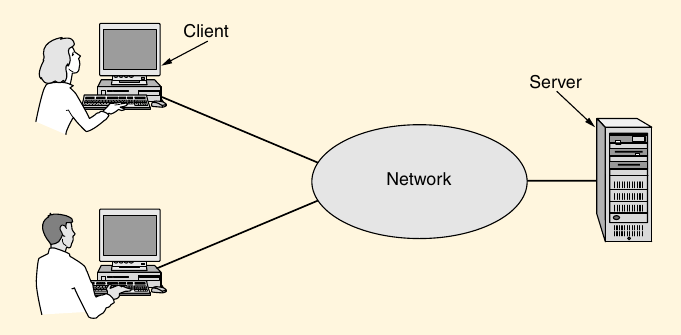

# Networking

A large number of separate but interconnected computers, these systems are called computer network.

Two computers are said to be interconnected if they are able to exchange information. The connection need not be via a copper wire; fiber optics, microwaves, infrared and communication satellites can also be used. Networks come in many sizes, shapes and form. They are usually connected together to make larger networks, with the **Internet** being the most well-known example of network of networks.

----------

#### Distributed System

The key distinction is that in a distributed system, a collection of independent computers appears to its uses as a single coherent system. Usually, it has a single model or paradigm that it presents to the users. Often a layer of software on top of the operating system, called **middleware**, is responsible for implementing this model. A well-known example of a distributed system is the **World Wide Web**. It runs on top of the Internet and presents a model in which everything looks like a document (Web pages).

----------

In a computer network, this coherence, model, and software are absent. Users are exposed to the actual machines, without any attempt by the system to make the machines look and act in a coherent way. If the machines have different hardware and different operations systems, that is fully visible to the users. If a user wants to run a program on a remote machine, he/she has to log onto that machine and run it there.

## Uses of Computer Networks

### Business Applications

- **Resource Sharing**: The goal is to make all programs, equipment, and especially data available to anyone on the network without regard to other physical location of the resource or the user.

- **VPNs (Virtual Private Networks)**: A virtual private network is a mechanism for creating a secure connection between a computing device and a computer network, or between two networks, using an insecure communication medium such as the public Internet.

- **client-server model**: In this model data is stored on powerfull computers called **servers**. The employees have simpler machines, called **clients**, with which they access remote data. 

- **Web application**: The server generates Web pages based on its data based in response to client requests.

- **Communication medium**: A computer network can provide a powerfull **communication medium among employees. Virtually every company that has two ore more computers now has **email (electronic mail)**, which empl