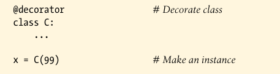
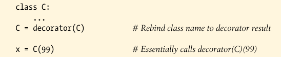

# Class Decorators

Class decorators are strongly related to function decorators; in fact, they use the same syntax and very similar coding patterns. Rather then wrapping individual functions or methods, though, class decorators are a way to manage classes, or wraps up instance construction calls with extra logic that manges or augments instances created from a class.

### Usage

is equivalent to the following--the class is automatically passed to the decorator function, and the decorator's result is assigned back to the class name:

The net effect isthat calling the class name later to create an instance winds up triggering the callable returned by the decorator, which may or may not call the original class itself.

### Implementation

