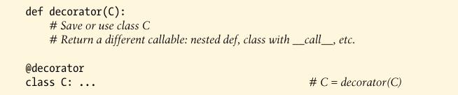

# Class Decorators

Class decorators are strongly related to function decorators; in fact, they use the same syntax and very similar coding patterns. Rather then wrapping individual functions or methods, though, class decorators are a way to manage classes, or wraps up instance construction calls with extra logic that manges or augments instances created from a class.

### Usage


is equivalent to the following--the class is automatically passed to the decorator function, and the decorator's result is assigned back to the class name:


The net effect isthat calling the class name later to create an instance winds up triggering the callable returned by the decorator, which may or may not call the original class itself.

----------

### Implementation

class decorators are coded with many of the same techniques used for function decorators, though some may involve *two levels* of augmentation--to manage both instance construction calls, as well as instance interface access. Because the class decorator is also a *callable that returns a callable*, most combinations of functions and classes suffice.

To simply manage a class just after it is created, return the orignal class itself:

```py

In [4]: def decorator(C):
   ...:     # Process class C
   ...:     return C
   ...: 

In [5]: @decorator
   ...: class C: ...                  # C = decorator(C)

```

Io instead insert a wrapper layer that intercepts later instance creation calls, return a different callable object:



The callable returned by such as class decorator typically creates and returns a new instance of the original class, augment in some way to manage its interface.